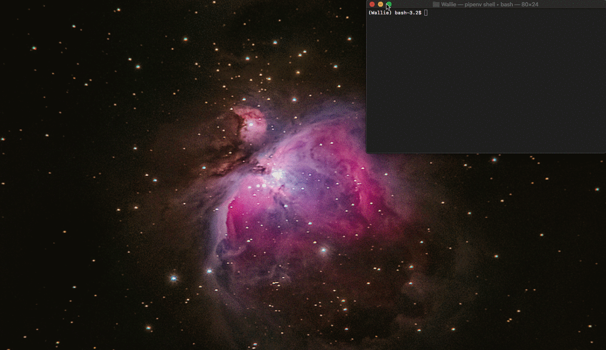
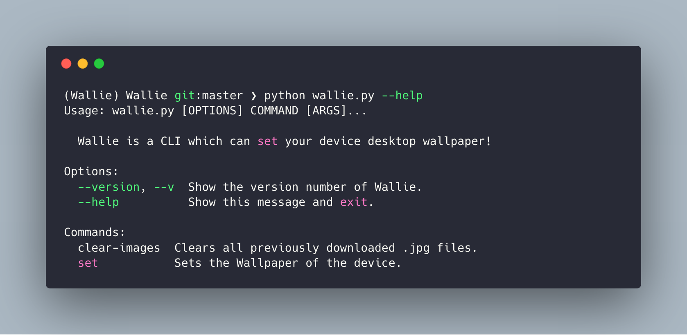

# Wallie
Wallie is a CLI which can set your device desktop wallpaper!


## Supported APIs
* Unsplash
* Pexels
* Pixabay 

## OS Support
* Windows, Mac, Linux

## Supported Linux Environments
* KDE (Tested on Kubuntu)
* GNOME (Tested on Ubuntu)
* LX(DE/QT) (Tested on Lubuntu 18.04 and 18.10)
* Mate (Tested on Ubuntu Mate)

## Usage


## Dependancies
Wallie currently requires:
```
[dev-packages]
black = "*"

[packages]
requests = "*"
click = "*"
colorama = "*"
pypexels = "*"
pyunsplash = "*"
python-pixabay = "*"

[requires]
python_version = "3.7"
```

Install all dependancies using the following command:
```
pipenv install
```

## Authors -- Contributors

* **Daniel Brennand** - *Author* - [Dextroz](https://github.com/Dextroz)
* **Momozor** - *Contributor* - [Momozor](https://github.com/momozor)

## License

This project is licensed under the GNU GENERAL PUBLIC LICENSE Version 3 License - see the [LICENSE](LICENSE) for details.

## Acknowledgments

* Requests created by [Kenneth Reitz (kennethreitz)](https://github.com/kennethreitz) and respective contributors.
* Pypexels and Pyunsplash wrappers by [salvoventura](https://github.com/salvoventura) and respective contributors.
* python-pixabay by [momozor](https://github.com/momozor) and respective contributors.
